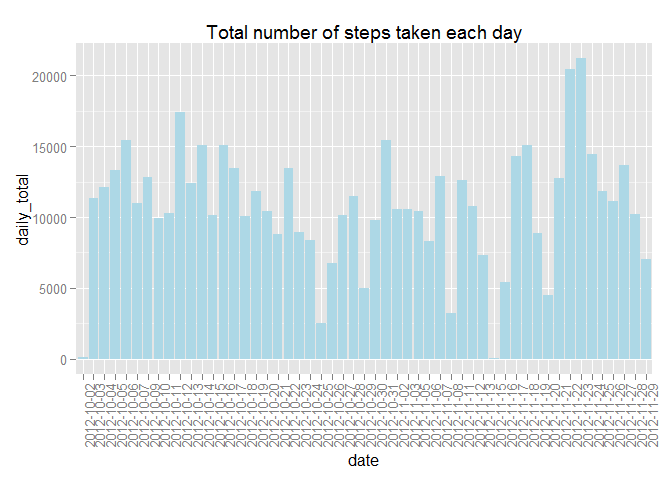
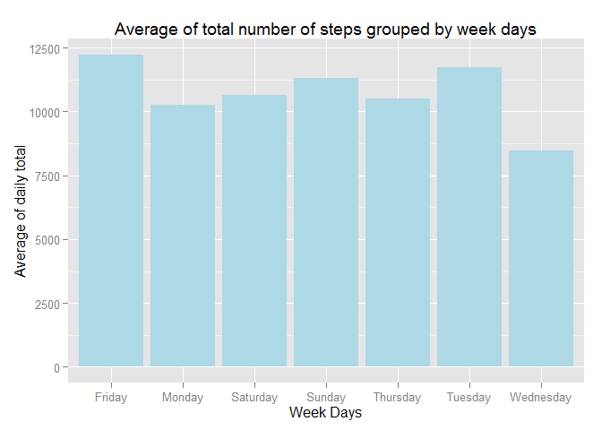
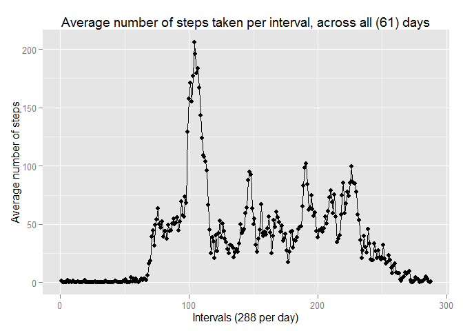
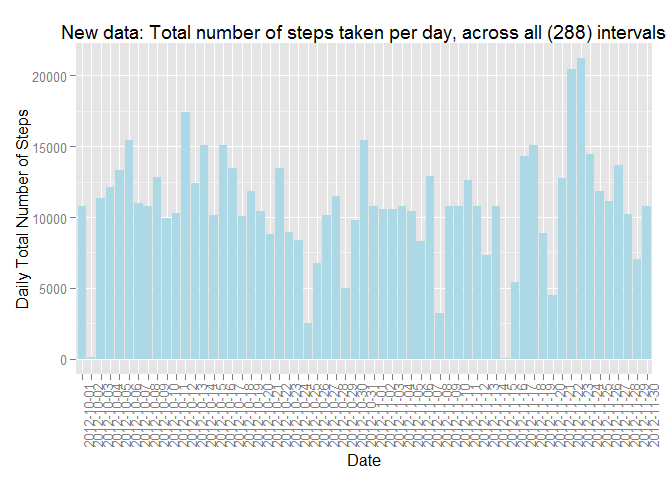
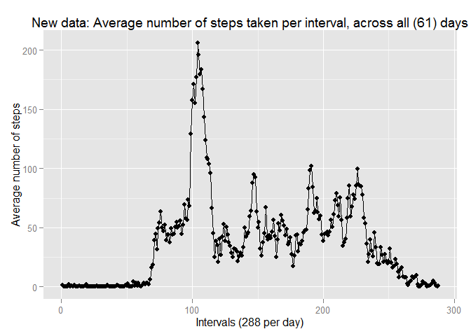
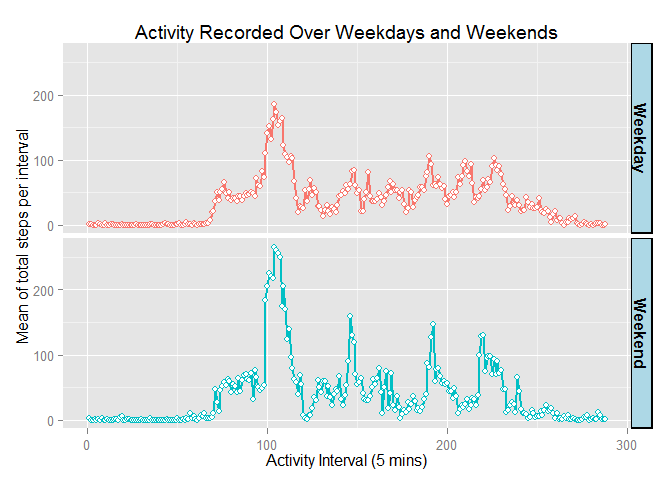
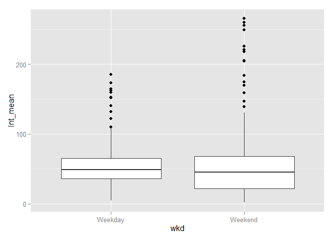

# Reproducible Research - Programming Assignment 1

### Introduction

Monitoring devices are being used by health cautious people as well as certain patients to record and track their daily physical activities. Translated to the number of steps taken, these data can help individuals to make adjustment to their daily workouts and even changing their life style for a healthier life.  

Using the data set produced from a device worn by a volunteer for 24 hours a day over two months we would like to analyze the measured data (number of steps), collected every 5 minutes to assess if there is a trend in the subject's daily activities.

### Data Set

The data set is downloaded from this site: 
[Dataset: Activity monitoring data](https://d396qusza40orc.cloudfront.net/repdata%2Fdata%2Factivity.zip) 

The variables included in this data set are:

* steps: Number of steps taking in a 5-minute interval (missing values are coded as NA)    
* date: The date on which the measurement was taken in YYYY-MM-DD format    
* interval: Identifier for the 5-minute interval in which measurement was taken    

The data set is stored in a comma-separated-value (CSV) file and there are a total of 17,568 observations (collection interval) in this data set. There are 288 (=24x12) collection intervals per day. The subject was wearing the device for 61 consecutive days between 10/1/2012-11/30/2012, which comes to a total of 17,568 (288x61) observations. 

### Analysis

**Loading and preprocessing the data**  

* Load the data set and the required libraries.  
* Remove NAs, and format the data.


```r
# Read data in and format
library(ggplot2)
library(plyr)
library(gcookbook) 
data <- read.csv2("repdata_data_activity/activity.csv",header=TRUE,sep=",",colClasses = "character")
data$steps <- as.numeric(data$steps)
data$interval <- as.numeric(data$interval)
# Remove NAs
data1 <- data[!is.na(data$steps),]
```
Since variables Interval and Date did not have any NAs, the variable stps is used to remove rows with NAs.

__*Total number of steps taken per day*__    

* Make a histogram of the total number of steps taken each day
* Calculate and report the mean and median of total number of steps taken per day
* Is there a patter in the plot that could indicate a trend in subject's activities. 


```r
# Calculate total steps for each day and plot
dailyTotal <- ddply(data1, "date", summarise, daily_total = sum(steps))
ggplot(dailyTotal, aes(x=date, y=daily_total)) +
    geom_bar(stat="identity", fill="lightblue", colr="black") +
    ggtitle("Total number of steps taken each day") +
    theme(axis.text.x = element_text(angle=90))
```

 

```r
# Print Mean and Median of daily total steps
mean(dailyTotal$daily_total)
```

```
## [1] 10766
```

```r
median(arrange(dailyTotal,daily_total)$daily_total)
```

```
## [1] 10765
```

There is inconsistency in subject's daily activities, since total number of steps is not uniform across all days. Few days have much smaller values than the visual average. Let's check if the low values fall in a specific day of the week. I calculated and plotted means of total steps taken in each day of the week averaged across eight weeks of monitoring. Data for Wednesday show lower mean due to missing values (NAs). Large percentage of missing data happen to be on wednesdays. More on this is discussed in section "Missing observations".


```r
# Total by weekdays across all weeks.
dailyTotal$wkd <- as.factor(weekdays(as.POSIXlt(dailyTotal$date, format="%Y-%M-%d")))
weekly <- ddply(dailyTotal, "wkd", summarise, wkd_mean = mean(daily_total))
ggplot(weekly, aes(x=wkd, y=wkd_mean)) +
    geom_bar(stat="identity", fill="lightblue", colr="black") +
    xlab("Week Days") + ylab("Average of daily total") +
    ggtitle("Average of total number of steps grouped by week days")
```

 

__*Daily activity pattern*__   

* What is the average daily activity pattern?
    + Make a time series plot of the 5-minute interval and the average number of steps taken, averaged across all days  
    + Which 5-minute interval, on average across all the days in the data set, contains the maximum number of steps?  


```r
# Average per interval across all days
intMean <- ddply(data1, "interval", summarise, Average_Interval = mean(steps))
ggplot(intMean,aes(x=c(1:nrow(intMean)),y=Average_Interval)) + geom_line() + geom_point() +
    xlab("Intervals (288 per day)") + ylab("Average number of steps") +
    ggtitle("Average number of steps taken per interval, across all (61) days")
```

 

```r
maxval <- intMean[intMean$Average_Interval==max(intMean$Average_Interval),]
peak <- round(maxval[2],1)
interval <- rownames(maxval)
```

There is a clear pattern in daily activities. Activities pick up in the morning and fluctuates throughout the day with the maximum peak value of 206.2, which occurs in interval 104, around 9 AM.        

__*Imputing missing values*__  

The presence of missing days may introduce bias into some calculations or summaries of the data.  

* Calculate and report the total number of missing values in the data set (i.e. the total number of rows with NAs)
* Devise a strategy for filling in all of the missing values in the data set. The strategy does not need to be sophisticated. For example, you could use the mean/median for that day, or the mean for that 5-minute interval, etc.  
* Create a new data set that is equal to the original data set but with the missing data filled in.  
* Make a histogram of the total number of steps taken each day and Calculate and report the mean and median total number of steps taken per day. 
    + Do these values differ from the estimates from the first part of the assignment? 
    + What is the impact of imputing missing data on the estimates of the total daily number of steps?  

__*Missing observations*__  

Calculate number of missing observation and then match them against the dates and the days of a week. 


```r
# Calculate number of missing observations and the day of week they occured. 
miss_obs <- subset(data, is.na(data$steps), drop=F)
uniq_missing_date <- unique(miss_obs$date)
wday <- as.factor(weekdays(as.POSIXlt(uniq_missing_date, format="%Y-%M-%d")))
uniq_missing_date
```

```
## [1] "2012-10-01" "2012-10-08" "2012-11-01" "2012-11-04" "2012-11-09"
## [6] "2012-11-10" "2012-11-14" "2012-11-30"
```

```r
wday
```

```
## [1] Wednesday Wednesday Wednesday Saturday  Thursday  Friday    Tuesday  
## [8] Thursday 
## Levels: Friday Saturday Thursday Tuesday Wednesday
```

The original data set has 2304 NAs in the steps variable, which belong to 8 days. That is, there isn't a single observation for either of the missing days, perhaps the subject was not wearing the device on those days. Most of the missing data happens on wednesday of the week.  

__*Strategy to compensate for missing observations*__  

Estimating the mean or median for the missing days is not possible due to lack of measurement for that day. For total daily steps we could use the data in "weekly" bar graph (calculated above) for any missing day of the week, but these data can not be used for replacing the missing interval data. However, we could use the interval averages for calculating both daily total and average interval.   

To create the new data set we merge the original data with the interval mean (intMean) data frame to match the intervals and to bring the associated data (Average_Interval) into one table. Then, by walking through the new table replace the missing steps (NA) with the average of corresponding interval.  


```r
# Use interval means to replace missing observations for each interval of the missing day
newdata <- merge(data,intMean,by="interval")
for (i in 1:nrow(newdata)) if (is.na(newdata$steps[i])) newdata$steps[i] <- newdata$Average_Interval[i]    
```

Plot of new data set for daily total: 


```r
# New Data set: Plot total steps per day
dailyTotNA <- ddply(newdata, "date", summarise, daily_total_noNA = sum(steps))
ggplot(dailyTotNA, aes(x=date, y=daily_total_noNA)) + 
    geom_bar(stat="identity", fill="lightblue", colr="black") +
    theme(axis.text.x = element_text(angle=90)) +
    xlab("Date") + ylab("Daily Total Number of Steps") +
    ggtitle("New data: Total number of steps taken per day, across all (288) intervals")
```

 

```r
mean(dailyTotNA$daily_total_noNA)
```

```
## [1] 10766
```

```r
median(arrange(dailyTotNA,daily_total_noNA)$daily_total_noNA)
```

```
## [1] 10766
```

As expected, there are no significant differences between the medians and means of old and new data. 

Plot of new data set for interval means:


```r
# New Data: Plot average of steps for each interval, accross all days
intMeanNA <- ddply(newdata, "interval", summarise, Average_noNA = mean(steps))
ggplot(intMeanNA,aes(x=c(1:nrow(intMeanNA)),y=Average_noNA)) + geom_line() + geom_point() +
    xlab("Intervals (288 per day)") + ylab("Average number of steps") +
    ggtitle("New data: Average number of steps taken per interval, across all (61) days")
```

 

As expected, because we used the daily average and interval average to estimate the missing data, there aren't any noticeable change between patterns of data with or without replacing NAs. Averages of intervals across all days show a better fit because it covers a larger (288*61) sample size (basline).   

__*Weekdays vs Weekends*__  

Are there differences in activity patterns between weekdays and weekends?


```r
# Create a factor and convert day of the week to weekday and weekend.
newdata$wkd <- as.factor(weekdays(as.POSIXlt(newdata$date, format="%Y-%M-%d")))
levels(newdata$wkd)[c(3:4)] <- "Weekend"
levels(newdata$wkd)[c(1,2,4,5,6)] <- "Weekday"

wkdayend <- ddply(newdata, c("wkd", "interval"), summarise, Int_mean = mean(steps))
wkdayend$INTERVAL <- rep(1:288,2)
ggplot(wkdayend,aes(x=INTERVAL, y=Int_mean, color=wkd)) + geom_line(size=1) + 
    geom_point(size=2, shape=21, fill="white") + facet_grid(wkd ~ .) + 
    xlab("Activity Interval (5 mins)") + ylab("Mean of total steps per interval") + 
    ggtitle("Activity Recorded Over Weekdays and Weekends") +
    theme(legend.position="none", strip.text=element_text(face="bold", size=rel(1)),
          strip.background=element_rect(fill="lightblue", colour="black", size=1))
```

 

On the average, activities are the same during weekdays and weekends. This could very well indicate that the subject's activities were more intense over the weekend. This can be verified in a boxplot, shown below. To get a better picture, I removed the noise (data between evening and early morning) from the data set to focus on subject's active time.  


```r
# Verify weekends' higher activities compared to weekdays
highActive <- wkdayend[wkdayend$INTERVAL>70 & wkdayend$INTERVAL<260,]
ggplot(highActive, aes(x=wkd, y=Int_mean)) + geom_boxplot()
```

 
